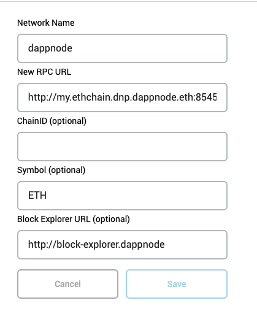

# Block Explorer DappNode Package

Block explorer that reads data local ethchain dappnode dapp.

## Usage
The dappnode block explorer uses local data to provade a ethereum block explorer that is fast, reliable, and private.

### Installation
1. Download this dnp `/ipfs/QmbzqL2F9S4T3mAMcgFWo1Jn63BTSmVBoGJp6ckdQsbZyf` via your dnp installer: http://my.dappnode/#/installer
2. Access your block explorer at http://block-explorer.dappnode

### Metamask Integration
You can also set this dapp as the block explorer for your metamask!

Simply set the block explorer to `http://block-explorer.dappnode` in metamask network settings for your custom dappnode network.

## License
This project is licensed under the GNU General Public License v3.0 - see the LICENSE file for details
